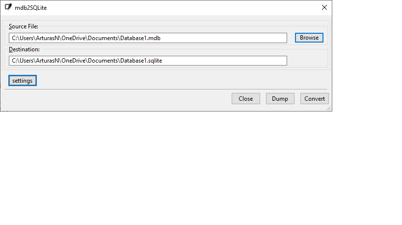
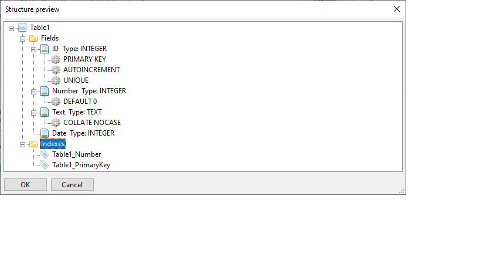

# mdb2sqlite
mdb2sqlite is a simple tool to convert MS Access database files to SQLite database files.
This tool is provided with a User interface created using wxWidgets.

 

## Compiling
To build the project yourself you have to build wxWidgets for your appropriate toolset and then generate the project using CMake:

1) Browse to mdb2sqlite/wxwidgets/build/msw 
2) Choose the appropriate solution file toolset
3) Build the dll debug and dll release configurations.
4) Generate mdb2sqlite project using CMake selecting the required too
